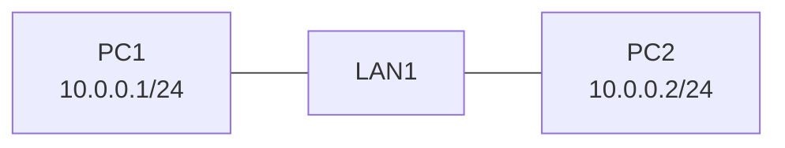

# kathara-dos-pcs
Laboratorio básico de conectividad con Kathará

## Topología del laboratorio

```mermaid
flowchart LR
    PC1["PC1<br/>10.0.0.1/24"] --- LAN["LAN1"]
    LAN --- PC2["PC2<br/>10.0.0.2/24"]
```
